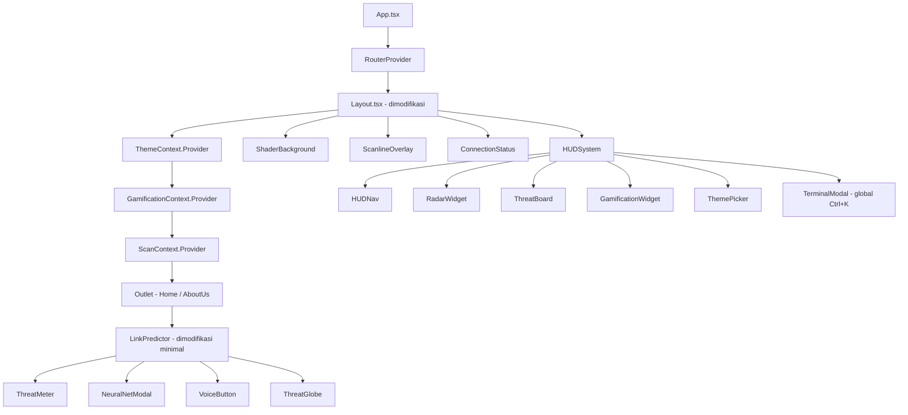
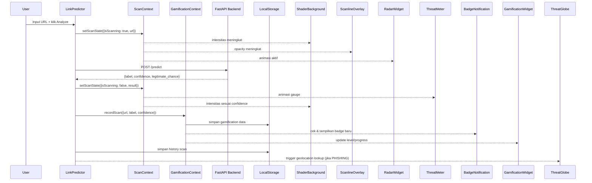

# Dokumen Desain — PhishGuard v2 Enhancement

## Ikhtisar

PhishGuard v2 Enhancement menambahkan 12 fitur besar ke atas arsitektur React 18 + Vite + Three.js yang sudah ada. Strategi utama adalah **additive-only**: semua fitur baru ditambahkan sebagai komponen/hook baru tanpa memodifikasi logika inti `LinkPredictor.tsx` dan `App.tsx` secara destruktif. Integrasi dilakukan melalui context providers dan prop injection yang opsional.

### Prinsip Desain

- **Backward-compatible**: Semua route, komponen, dan API call yang ada tetap berfungsi.
- **Feature-flagged**: Setiap fitur baru dapat dinonaktifkan via environment variable atau localStorage flag.
- **Performance-first**: WebGL dan animasi berat menggunakan lazy loading dan `React.Suspense`.
- **Graceful degradation**: Setiap fitur yang bergantung pada browser API modern memiliki fallback.

---

## Arsitektur

### Struktur Folder Baru

```
src/
├── app/
│   ├── components/
│   │   ├── hud/
│   │   │   ├── HUDSystem.tsx          # Container utama HUD
│   │   │   ├── HUDNav.tsx             # Panel navigasi slide-in
│   │   │   ├── RadarWidget.tsx        # Komponen radar pojok kanan atas
│   │   │   └── ScanlineOverlay.tsx    # Overlay scanlines fullscreen
│   │   ├── globe/
│   │   │   ├── ThreatGlobe.tsx        # Globe @react-three/fiber
│   │   │   └── ThreatPointModal.tsx   # Modal detail titik ancaman
│   │   ├── terminal/
│   │   │   ├── TerminalModal.tsx      # Command palette modal
│   │   │   ├── commandParser.ts       # Pure function parser perintah
│   │   │   └── useTypewriter.ts       # Hook efek typewriter
│   │   ├── gamification/
│   │   │   ├── GamificationWidget.tsx # Widget level + badge
│   │   │   ├── BadgeNotification.tsx  # Toast notifikasi badge
│   │   │   └── gamificationLogic.ts   # Pure functions level/badge
│   │   ├── analysis/
│   │   │   ├── NeuralNetModal.tsx     # Modal visualisasi D3.js
│   │   │   ├── UrlHeatmap.tsx         # Heatmap karakter URL
│   │   │   └── featureExtractor.ts    # Pure function ekstraksi fitur URL
│   │   ├── collaboration/
│   │   │   ├── ThreatBoard.tsx        # Panel threat board
│   │   │   └── useCollaboration.ts    # Hook simulasi/WebSocket
│   │   ├── voice/
│   │   │   ├── VoiceButton.tsx        # Tombol mikrofon + waveform
│   │   │   └── useVoiceCommand.ts     # Hook Web Speech API
│   │   ├── threat/
│   │   │   ├── ThreatMeter.tsx        # Gauge SVG setengah lingkaran
│   │   │   └── useAudioFeedback.ts    # Hook Howler.js
│   │   ├── theme/
│   │   │   ├── ThemePicker.tsx        # UI pemilih tema
│   │   │   └── themeConfig.ts         # Definisi 3 tema
│   │   ├── shader/
│   │   │   └── ShaderBackground.tsx   # @react-three/fiber shader bg
│   │   └── pwa/
│   │       ├── PWAInstallPrompt.tsx   # Prompt install PWA
│   │       └── ConnectionStatus.tsx   # Indikator online/offline
│   ├── context/
│   │   ├── ThemeContext.tsx           # Provider tema global
│   │   ├── GamificationContext.tsx    # Provider gamifikasi global
│   │   └── ScanContext.tsx            # Provider state scan global
│   └── hooks/
│       ├── useLocalStorage.ts         # Generic localStorage hook
│       └── useOnlineStatus.ts         # Hook status koneksi
├── styles/
│   └── index.css                      # Tambah CSS variables tema baru
└── sw.ts                              # Service worker entry (Workbox)
```

### Diagram Arsitektur Tingkat Tinggi



### Data Flow Utama



---

## Komponen dan Antarmuka

### 1. ScanContext

Context global yang menjadi jembatan antara `LinkPredictor` dan komponen-komponen yang bereaksi terhadap state scan.

```typescript
// src/app/context/ScanContext.tsx
interface ScanState {
  isScanning: boolean;
  currentUrl: string;
  result: ScanResult | null;
}

interface ScanResult {
  label: 'PHISHING' | 'LEGITIMATE';
  confidence: number;
  legitimateChance: number;
  timestamp: number;
}

interface ScanContextValue {
  scanState: ScanState;
  setScanState: (state: Partial<ScanState>) => void;
  recordScan: (result: ScanResult & { url: string }) => void;
}
```

`LinkPredictor` akan memanggil `setScanState` pada titik-titik kunci: saat scan dimulai, saat selesai, dan saat ada hasil. Ini adalah satu-satunya modifikasi yang diperlukan pada `LinkPredictor.tsx`.

### 2. HUD System

```typescript
// src/app/components/hud/HUDSystem.tsx
interface HUDSystemProps {
  children?: React.ReactNode; // slot untuk konten tambahan di panel
}

// State internal
interface HUDState {
  isOpen: boolean;
  cursorNearEdge: boolean; // true jika cursor x < 20px dari tepi kiri
}
```

**Logika trigger:**
- `onMouseMove`: jika `e.clientX < 20`, set `cursorNearEdge = true` → buka panel
- `onMouseLeave` dari panel: set `isOpen = false`
- Fallback: jika `window.PointerEvent === undefined`, tampilkan tombol toggle permanen

**Animasi Framer Motion:**
```typescript
const hudVariants = {
  hidden: { x: -220, opacity: 0 },
  visible: { x: 0, opacity: 1, transition: { duration: 0.25, ease: 'easeOut' } },
  exit: { x: -220, opacity: 0, transition: { duration: 0.2 } }
};
```

### 3. RadarWidget

Komponen SVG murni dengan animasi CSS. Tidak menggunakan Three.js untuk menjaga performa.

```typescript
// src/app/components/hud/RadarWidget.tsx
interface RadarWidgetProps {
  isPhishingDetected: boolean; // dari ScanContext
  isScanning: boolean;
}
// Render: SVG lingkaran konsentris + garis berputar (CSS animation)
// Saat isPhishingDetected: tambahkan titik merah dengan animasi pulse
```

### 4. ShaderBackground

```typescript
// src/app/components/shader/ShaderBackground.tsx
// Menggunakan @react-three/fiber Canvas dengan shader material

const vertexShader = `
  varying vec2 vUv;
  void main() {
    vUv = uv;
    gl_Position = projectionMatrix * modelViewMatrix * vec4(position, 1.0);
  }
`;

const fragmentShader = `
  uniform float uTime;
  uniform float uIntensity;   // 0.0 (idle) → 1.0 (scanning)
  uniform float uConfidence;  // 0.0 → 1.0
  uniform vec3 uAccentColor;  // dari ThemeContext
  varying vec2 vUv;

  void main() {
    // Data stream wave effect
    float wave = sin(vUv.y * 20.0 + uTime * 2.0) * 0.5 + 0.5;
    float intensity = wave * uIntensity * 0.15;
    // Chromatic aberration berdasarkan confidence
    float aberration = uConfidence * 0.02;
    vec3 color = uAccentColor * intensity;
    gl_FragColor = vec4(color, intensity);
  }
`;

interface ShaderUniforms {
  uTime: number;
  uIntensity: number;   // dikontrol oleh ScanContext
  uConfidence: number;  // dikontrol oleh ScanContext
  uAccentColor: THREE.Color; // dikontrol oleh ThemeContext
}
```

**Fallback WebGL:**
```typescript
if (!isWebGLSupported()) {
  return <div style={{ background: 'var(--cyber-bg)', animation: 'cyber-pulse 3s ease infinite' }} />;
}
```

### 5. ThreatGlobe

```typescript
// src/app/components/globe/ThreatGlobe.tsx
interface ThreatPoint {
  lat: number;
  lng: number;
  urls: string[];
  country: string;
}

interface ThreatGlobeProps {
  threatPoints: ThreatPoint[];
  onPointClick: (point: ThreatPoint) => void;
}
```

**Konversi koordinat lat/lng ke posisi 3D:**
```typescript
function latLngToVector3(lat: number, lng: number, radius: number): THREE.Vector3 {
  const phi = (90 - lat) * (Math.PI / 180);
  const theta = (lng + 180) * (Math.PI / 180);
  return new THREE.Vector3(
    -radius * Math.sin(phi) * Math.cos(theta),
    radius * Math.cos(phi),
    radius * Math.sin(phi) * Math.sin(theta)
  );
}
```

**Integrasi ip-api.com:**
```typescript
async function resolveGeoLocation(url: string): Promise<{ lat: number; lng: number } | null> {
  try {
    const domain = new URL(url).hostname;
    const res = await fetch(`http://ip-api.com/json/${domain}?fields=lat,lon,status`);
    const data = await res.json();
    if (data.status === 'success') return { lat: data.lat, lng: data.lon };
    return null;
  } catch {
    return null; // fallback ke data dummy
  }
}
```

### 6. Terminal Command Mode

```typescript
// src/app/components/terminal/commandParser.ts
type CommandResult =
  | { type: 'scan'; url: string }
  | { type: 'history' }
  | { type: 'stats' }
  | { type: 'clear' }
  | { type: 'theme'; themeName: string }
  | { type: 'export' }
  | { type: 'error'; message: string };

function parseCommand(input: string): CommandResult {
  const parts = input.trim().split(/\s+/);
  const cmd = parts[0].toLowerCase();
  switch (cmd) {
    case 'scan':
      if (!parts[1]) return { type: 'error', message: 'Usage: scan <url>' };
      return { type: 'scan', url: parts[1] };
    case 'history': return { type: 'history' };
    case 'stats': return { type: 'stats' };
    case 'clear': return { type: 'clear' };
    case 'theme':
      const valid = ['neon-noir', 'crimson-dawn', 'arctic-hack'];
      if (!valid.includes(parts[1])) return { type: 'error', message: `Unknown theme: ${parts[1]}` };
      return { type: 'theme', themeName: parts[1] };
    case 'export': return { type: 'export' };
    default: return { type: 'error', message: `Command not found: ${cmd}` };
  }
}
```

**Hook typewriter:**
```typescript
// src/app/components/terminal/useTypewriter.ts
function useTypewriter(text: string, speed = 30): string {
  const [displayed, setDisplayed] = useState('');
  useEffect(() => {
    setDisplayed('');
    let i = 0;
    const iv = setInterval(() => {
      setDisplayed(text.slice(0, ++i));
      if (i >= text.length) clearInterval(iv);
    }, speed);
    return () => clearInterval(iv);
  }, [text, speed]);
  return displayed;
}
```

### 7. Gamification System

```typescript
// src/app/components/gamification/gamificationLogic.ts
interface GamificationState {
  totalScans: number;
  phishingDetected: number;
  badges: BadgeId[];
  highestConfidence: number;
  sessionScans: number;
}

type BadgeId = 'first_scan' | 'scan_10' | 'scan_50' | 'first_phishing' | 'confidence_95' | 'first_qr';

type Level = 'Script Kiddie' | 'White Hat' | 'Elite Hacker' | 'Neo';

function calculateLevel(totalScans: number): Level {
  if (totalScans >= 100) return 'Neo';
  if (totalScans >= 50) return 'Elite Hacker';
  if (totalScans >= 10) return 'White Hat';
  return 'Script Kiddie';
}

function checkNewBadges(prev: GamificationState, next: GamificationState): BadgeId[] {
  const newBadges: BadgeId[] = [];
  if (next.totalScans === 1 && !prev.badges.includes('first_scan')) newBadges.push('first_scan');
  if (next.totalScans >= 10 && !prev.badges.includes('scan_10')) newBadges.push('scan_10');
  if (next.totalScans >= 50 && !prev.badges.includes('scan_50')) newBadges.push('scan_50');
  if (next.phishingDetected >= 1 && !prev.badges.includes('first_phishing')) newBadges.push('first_phishing');
  if (next.highestConfidence >= 95 && !prev.badges.includes('confidence_95')) newBadges.push('confidence_95');
  return newBadges;
}
```

### 8. Feature Extractor (Neural Network Visualization)

```typescript
// src/app/components/analysis/featureExtractor.ts
interface UrlFeature {
  name: string;
  value: number;       // 0.0 – 1.0 (normalized importance)
  description: string;
}

function extractFeatures(url: string): UrlFeature[] {
  const features: UrlFeature[] = [
    {
      name: 'URL Length',
      value: Math.min(url.length / 200, 1.0),
      description: `Panjang URL: ${url.length} karakter`
    },
    {
      name: 'Special Chars',
      value: Math.min((url.match(/[@\-\/\/]/g)?.length ?? 0) / 10, 1.0),
      description: 'Karakter khusus (@, -, //)'
    },
    {
      name: 'Suspicious Keywords',
      value: /login|secure|bank|verify|account|update/i.test(url) ? 0.9 : 0.1,
      description: 'Kata kunci mencurigakan'
    },
    {
      name: 'Subdomain Count',
      value: Math.min((url.match(/\./g)?.length ?? 0) / 5, 1.0),
      description: 'Jumlah subdomain'
    },
    {
      name: 'HTTPS',
      value: url.startsWith('https://') ? 0.1 : 0.8,
      description: url.startsWith('https://') ? 'Menggunakan HTTPS' : 'Tidak menggunakan HTTPS'
    },
  ];
  return features;
}
```

### 9. Collaboration Hook

```typescript
// src/app/components/collaboration/useCollaboration.ts
interface CollabEntry {
  userId: string;
  url: string;
  label: 'PHISHING' | 'LEGITIMATE';
  timestamp: number;
}

const MOCK_PHISHING_URLS = [
  'http://secure-login-verify.com/account',
  'http://paypal-update.phishing.net/verify',
  // ... 20+ URL mock
];

function useCollaboration(wsUrl?: string) {
  const [entries, setEntries] = useState<CollabEntry[]>([]);
  const [isOffline, setIsOffline] = useState(false);
  const userId = useRef(`User_${Math.random().toString(36).slice(2, 6).toUpperCase()}`);

  useEffect(() => {
    // Coba WebSocket jika wsUrl tersedia
    if (wsUrl) {
      const ws = new WebSocket(wsUrl);
      ws.onmessage = (e) => addEntry(JSON.parse(e.data));
      ws.onerror = () => { setIsOffline(true); startSimulation(); };
      return () => ws.close();
    }
    // Fallback: simulasi setInterval
    startSimulation();
  }, []);

  function startSimulation() {
    const interval = 5000 + Math.random() * 10000; // 5–15 detik
    const iv = setInterval(() => {
      const mockEntry: CollabEntry = {
        userId: `User_${Math.random().toString(36).slice(2, 6).toUpperCase()}`,
        url: MOCK_PHISHING_URLS[Math.floor(Math.random() * MOCK_PHISHING_URLS.length)],
        label: 'PHISHING',
        timestamp: Date.now(),
      };
      addEntry(mockEntry);
    }, interval);
    return () => clearInterval(iv);
  }

  function addEntry(entry: CollabEntry) {
    setEntries(prev => [entry, ...prev].slice(0, 10)); // max 10 entri
  }

  return { entries, isOffline, currentUserId: userId.current };
}
```

### 10. Voice Command Hook

```typescript
// src/app/components/voice/useVoiceCommand.ts
interface VoiceCommandResult {
  type: 'scan' | 'history' | 'phishing_info' | 'unknown';
  url?: string;
}

function parseVoiceInput(transcript: string): VoiceCommandResult {
  const lower = transcript.toLowerCase();
  if (lower.includes('scan') || lower.includes('pindai')) {
    const urlMatch = transcript.match(/https?:\/\/\S+/);
    return { type: 'scan', url: urlMatch?.[0] };
  }
  if (lower.includes('riwayat') || lower.includes('history')) return { type: 'history' };
  if (lower.includes('phishing')) return { type: 'phishing_info' };
  return { type: 'unknown' };
}
```

### 11. Threat Meter

```typescript
// src/app/components/threat/ThreatMeter.tsx
// Gauge SVG setengah lingkaran (180 derajat)
// Radius: 80px, stroke-width: 12px
// Sudut jarum: -90deg (0%) → +90deg (100%)

function confidenceToColor(confidence: number): string {
  if (confidence <= 30) return '#00ff9d';  // hijau
  if (confidence <= 70) return '#ffff00';  // kuning
  return '#ff3b3b';                         // merah
}

function confidenceToPitch(confidence: number): number {
  if (confidence <= 30) return 0.5;
  if (confidence <= 70) return 1.0;
  return 2.0;
}
```

### 12. Theme System

```typescript
// src/app/components/theme/themeConfig.ts
interface ThemeConfig {
  id: 'neon-noir' | 'crimson-dawn' | 'arctic-hack';
  name: string;
  vars: Record<string, string>;
  threeAccentColor: string; // hex untuk Three.js material
}

const THEMES: ThemeConfig[] = [
  {
    id: 'neon-noir',
    name: 'Neon Noir',
    vars: {
      '--cyber-accent': '#00ff9d',
      '--cyber-accent-2': '#00ffff',
      '--cyber-danger': '#ff3b3b',
      '--cyber-bg': '#0a0f0f',
      '--cyber-text': '#e0e0e0',
    },
    threeAccentColor: '#00ff9d',
  },
  {
    id: 'crimson-dawn',
    name: 'Crimson Dawn',
    vars: {
      '--cyber-accent': '#ff3b3b',
      '--cyber-accent-2': '#ff6b6b',
      '--cyber-danger': '#ff0000',
      '--cyber-bg': '#0f0a0a',
      '--cyber-text': '#f0d0d0',
    },
    threeAccentColor: '#ff3b3b',
  },
  {
    id: 'arctic-hack',
    name: 'Arctic Hack',
    vars: {
      '--cyber-accent': '#00bfff',
      '--cyber-accent-2': '#87ceeb',
      '--cyber-danger': '#ff6b35',
      '--cyber-bg': '#080d14',
      '--cyber-text': '#e8f4f8',
    },
    threeAccentColor: '#00bfff',
  },
];

function applyTheme(themeId: string): void {
  const theme = THEMES.find(t => t.id === themeId) ?? THEMES[0];
  const root = document.documentElement;
  Object.entries(theme.vars).forEach(([key, value]) => {
    root.style.setProperty(key, value);
  });
  localStorage.setItem('phishguard_theme', themeId);
}
```

---

## Model Data

### LocalStorage Schema

```typescript
// Kunci-kunci LocalStorage yang digunakan

// Sudah ada (tidak diubah):
// "phishguard_history" → PredictionRecord[]

// Baru:
// "phishguard_gamification" → GamificationState
// "phishguard_theme" → 'neon-noir' | 'crimson-dawn' | 'arctic-hack'
// "phishguard_audio_enabled" → boolean (string 'true'/'false')
// "phishguard_speech_enabled" → boolean (string 'true'/'false')

interface PredictionRecord {
  url: string;
  label: 'PHISHING' | 'LEGITIMATE';
  confidence: number;
  timestamp: number;
}

interface GamificationState {
  totalScans: number;
  phishingDetected: number;
  badges: BadgeId[];
  highestConfidence: number;
  sessionScans: number;
  personalBest: {
    maxSessionScans: number;
    highestConfidence: number;
  };
}

// Validasi saat load dari LocalStorage:
function loadGamificationState(): GamificationState {
  try {
    const raw = localStorage.getItem('phishguard_gamification');
    if (!raw) return defaultGamificationState;
    const parsed = JSON.parse(raw);
    // Validasi struktur minimal
    if (typeof parsed.totalScans !== 'number') throw new Error('invalid');
    return parsed;
  } catch {
    return defaultGamificationState; // reset tanpa error ke user
  }
}
```

### ScanContext State

```typescript
interface ScanContextState {
  isScanning: boolean;
  currentUrl: string;
  result: {
    label: 'PHISHING' | 'LEGITIMATE';
    confidence: number;
    legitimateChance: number;
  } | null;
}
```

### PWA Manifest

```json
{
  "name": "PhishGuard",
  "short_name": "PhishGuard",
  "description": "Deep Learning Phishing Detection System",
  "theme_color": "#0a0f0f",
  "background_color": "#0a0f0f",
  "display": "standalone",
  "start_url": "/",
  "icons": [
    { "src": "/icons/icon-192.png", "sizes": "192x192", "type": "image/png" },
    { "src": "/icons/icon-512.png", "sizes": "512x512", "type": "image/png" }
  ]
}
```

---

## CSS Variables Schema (Tema)

Semua komponen yang sebelumnya menggunakan warna hardcoded akan dimigrasi ke CSS variables berikut:

```css
/* src/styles/index.css — tambahan */
:root {
  /* Warna aksen utama (berubah per tema) */
  --cyber-accent: #00ff9d;
  --cyber-accent-2: #00ffff;
  --cyber-danger: #ff3b3b;
  --cyber-bg: #0a0f0f;
  --cyber-text: #e0e0e0;

  /* Derived values (tidak berubah per tema) */
  --cyber-glass: rgba(255, 255, 255, 0.05);
  --cyber-border: rgba(255, 255, 255, 0.1);
  --cyber-glow: 0 0 15px var(--cyber-accent);
  --cyber-glow-danger: 0 0 15px var(--cyber-danger);

  /* Scanline opacity (dikontrol via JS) */
  --scanline-opacity: 0.03;
}
```

**Migrasi komponen yang ada:**
- `Layout.tsx`: `#00ff9d` → `var(--cyber-accent)`, `#0a0f0f` → `var(--cyber-bg)`
- `LinkPredictor.tsx`: semua warna hardcoded → CSS variables
- `StatisticWidget.tsx`: `#ff3b3b`, `#00ff9d` → `var(--cyber-danger)`, `var(--cyber-accent)`
- `ThreeScene.tsx`: warna material → dikontrol via `ThemeContext`

---

## Library Baru yang Perlu Diinstall

```bash
# Core 3D (upgrade dari Three.js vanilla ke @react-three/fiber)
npm install @react-three/fiber @react-three/drei

# Visualisasi neural network
npm install d3
npm install @types/d3

# Audio feedback
npm install howler
npm install @types/howler

# Efek confetti
npm install canvas-confetti
npm install @types/canvas-confetti

# PWA
npm install -D vite-plugin-pwa workbox-window

# Tidak perlu install tambahan untuk:
# - Web Speech API (native browser API)
# - Framer Motion (sudah ada)
# - Three.js (sudah ada)
# - Recharts (sudah ada)
```

**Update `vite.config.ts`:**
```typescript
import { VitePWA } from 'vite-plugin-pwa';

export default defineConfig({
  plugins: [
    react(),
    tailwindcss(),
    VitePWA({
      registerType: 'autoUpdate',
      workbox: {
        globPatterns: ['**/*.{js,css,html,ico,png,svg,woff2}'],
        runtimeCaching: [
          {
            urlPattern: /^https:\/\/ip-api\.com\//,
            handler: 'NetworkFirst',
            options: { cacheName: 'geo-api-cache', expiration: { maxEntries: 50 } }
          }
        ]
      },
      manifest: { /* lihat PWA Manifest di atas */ }
    }),
  ],
});
```

---

## Perubahan pada Komponen yang Sudah Ada

### Layout.tsx

**Perubahan minimal:**
1. Hapus `<aside>` sidebar statis → ganti dengan `<HUDSystem />`
2. Tambahkan `<ShaderBackground />` sebagai layer paling bawah
3. Tambahkan `<ScanlineOverlay />` sebagai layer overlay
4. Tambahkan `<ConnectionStatus />` di pojok layar
5. Wrap `<Outlet />` dengan `ThemeContext.Provider`, `GamificationContext.Provider`, `ScanContext.Provider`

```typescript
// Layout.tsx — struktur baru (pseudocode)
return (
  <ThemeContext.Provider>
    <GamificationContext.Provider>
      <ScanContext.Provider>
        <div style={{ height: '100vh', background: 'var(--cyber-bg)', overflow: 'hidden' }}>
          <ShaderBackground />        {/* layer 0 */}
          <CyberParticles />          {/* layer 1 - tidak berubah */}
          <ScanlineOverlay />         {/* layer 2 */}
          <HUDSystem />               {/* layer 3 - menggantikan sidebar */}
          <ConnectionStatus />        {/* pojok layar */}
          <TerminalModal />           {/* global Ctrl+K listener */}
          <main style={{ flex: 1, zIndex: 10, overflowY: 'auto', padding: '32px 40px' }}>
            <AnimatePresence mode="wait">
              <motion.div key={location.pathname} /* glitch transition variants */>
                <Outlet />
              </motion.div>
            </AnimatePresence>
          </main>
        </div>
      </ScanContext.Provider>
    </GamificationContext.Provider>
  </ThemeContext.Provider>
);
```

### LinkPredictor.tsx

**Perubahan minimal:**
1. Tambahkan `useScanContext()` hook
2. Panggil `setScanState({ isScanning: true })` saat `handleAnalyze` dimulai
3. Panggil `setScanState({ isScanning: false, result })` saat hasil diterima
4. Panggil `recordScan(result)` dari `GamificationContext`
5. Tambahkan `<ThreatMeter confidence={accuracy} />` di area hasil
6. Tambahkan `<VoiceButton onUrl={setUrl} />` di samping input
7. Tambahkan tombol "Lihat Cara Kerja Model" yang membuka `<NeuralNetModal />`
8. Tambahkan `<ThreatGlobe />` sebagai komponen terpisah di bawah grid utama

### ThreeScene.tsx

**Perubahan:**
1. Subscribe ke `ThemeContext` untuk mendapatkan warna aksen aktif
2. Update `mat.color` dan `dotMat.color` saat tema berubah
3. Pertimbangkan migrasi ke `@react-three/fiber` untuk konsistensi (opsional, tidak wajib)

### ToastNotification.tsx

**Perubahan:**
1. Tambahkan `drag` prop dari Framer Motion untuk drag-to-dismiss
2. Tambahkan `dragConstraints` dan `onDragEnd` handler

```typescript
// Tambahan pada ToastNotification
<motion.div
  drag="x"
  dragConstraints={{ left: 0, right: 300 }}
  onDragEnd={(_, info) => {
    if (info.offset.x > 100) onDone(); // dismiss jika drag > 100px
  }}
>
  {/* konten toast */}
</motion.div>
```

### StatisticWidget.tsx

**Perubahan:**
1. Tambahkan drag-to-dismiss pada setiap item riwayat scan
2. Tambahkan `onDelete` callback prop
3. Wrap item dengan `motion.li` yang memiliki `drag="x"` ke kiri

### AboutUs.tsx

**Perubahan:**
1. Tambahkan stagger animation pada grid `CollaboratorCard`
2. Wrap container dengan `motion.div` yang memiliki `variants` stagger

---

## Strategi Tidak Merusak Fungsionalitas Lama

### 1. Additive Context Pattern

Semua context baru menggunakan optional chaining. Komponen lama yang tidak menggunakan context tetap berfungsi normal:

```typescript
// Komponen lama tidak perlu diubah
function OldComponent() {
  // Tidak perlu tahu tentang ScanContext
  return <div>...</div>;
}

// Komponen baru menggunakan context
function NewComponent() {
  const { scanState } = useScanContext(); // hanya komponen baru yang subscribe
  return <div>{scanState.isScanning ? 'Scanning...' : 'Idle'}</div>;
}
```

### 2. Lazy Loading untuk Fitur Berat

```typescript
// Fitur berat di-lazy load untuk tidak mempengaruhi initial load time
const ThreatGlobe = lazy(() => import('./globe/ThreatGlobe'));
const NeuralNetModal = lazy(() => import('./analysis/NeuralNetModal'));
const ShaderBackground = lazy(() => import('./shader/ShaderBackground'));

// Digunakan dengan Suspense
<Suspense fallback={null}>
  <ThreatGlobe />
</Suspense>
```

### 3. Feature Flags via Environment Variables

```typescript
// src/app/config.ts
export const FEATURES = {
  SHADER_BG: import.meta.env.VITE_FEATURE_SHADER !== 'false',
  GLOBE: import.meta.env.VITE_FEATURE_GLOBE !== 'false',
  VOICE: import.meta.env.VITE_FEATURE_VOICE !== 'false',
  GAMIFICATION: import.meta.env.VITE_FEATURE_GAMIFICATION !== 'false',
};
```

### 4. Error Boundaries

Setiap fitur baru dibungkus dengan `ErrorBoundary` sehingga crash pada satu fitur tidak merusak seluruh aplikasi:

```typescript
<ErrorBoundary fallback={null}>
  <ShaderBackground />
</ErrorBoundary>
```

### 5. Backward-Compatible LocalStorage

Key baru tidak menimpa key yang sudah ada (`phishguard_history`). Semua key baru menggunakan prefix `phishguard_` yang konsisten.

---

## Correctness Properties

*A property is a characteristic or behavior that should hold true across all valid executions of a system — essentially, a formal statement about what the system should do. Properties serve as the bridge between human-readable specifications and machine-verifiable correctness guarantees.*

### Property 1: HUD Visibility Round Trip

*For any* posisi pointer yang masuk ke zona tepi kiri (x < 20px) lalu keluar dari area panel HUD, state `isOpen` HUD harus kembali ke `false` — yaitu, masuk lalu keluar harus mengembalikan state ke kondisi awal.

**Validates: Requirements 1.1, 1.2**

---

### Property 2: Scanline Opacity Berubah Sesuai State Scan

*For any* state scanning (`isScanning = true`), nilai CSS variable `--scanline-opacity` harus bernilai `0.08`; dan untuk semua state idle (`isScanning = false`), nilainya harus `0.03`.

**Validates: Requirements 1.4, 1.5**

---

### Property 3: Radar Menampilkan Pulse Merah Saat PHISHING

*For any* hasil prediksi dengan label `"PHISHING"`, komponen `RadarWidget` harus merender elemen dengan class atau style yang mengindikasikan animasi pulse merah; dan untuk semua hasil `"LEGITIMATE"`, elemen tersebut tidak boleh ada.

**Validates: Requirements 1.7**

---

### Property 4: Shader Intensity Mapping dari Confidence Score

*For any* nilai confidence score `c` dalam rentang `[0, 100]`, fungsi yang memetakan confidence ke intensitas shader harus mengembalikan nilai dalam rentang `[0.0, 0.3]` untuk `c ∈ [0, 30]`, `[0.3, 0.7]` untuk `c ∈ [30, 70]`, dan `[0.7, 1.0]` untuk `c ∈ [70, 100]`.

**Validates: Requirements 2.3, 2.4, 2.6**

---

### Property 5: Geolocation Lookup Dipanggil untuk Setiap URL Phishing

*For any* hasil prediksi dengan label `"PHISHING"`, fungsi `resolveGeoLocation` harus dipanggil tepat satu kali dengan domain dari URL tersebut.

**Validates: Requirements 3.2**

---

### Property 6: Globe Menampilkan Titik dari Data LocalStorage saat Mount

*For any* data riwayat scan di LocalStorage yang mengandung N entri PHISHING, komponen `ThreatGlobe` saat pertama kali di-mount harus merender tepat N titik ancaman (atau lebih sedikit jika beberapa domain memiliki koordinat yang sama).

**Validates: Requirements 3.8**

---

### Property 7: Command Parser Menghasilkan Output yang Benar

*For any* string input yang merupakan perintah valid (`scan`, `history`, `stats`, `clear`, `theme <valid>`, `export logs`), fungsi `parseCommand` harus mengembalikan objek dengan `type` yang sesuai; dan untuk semua input yang bukan perintah valid, harus mengembalikan `{ type: 'error', message: 'Command not found: ...' }`.

**Validates: Requirements 4.3, 4.4, 4.5, 4.6, 4.7, 4.8, 4.10**

---

### Property 8: Terminal State Persisten saat Hide/Show

*For any* daftar output terminal yang sudah ada, menyembunyikan lalu menampilkan kembali terminal harus menghasilkan daftar output yang identik (tidak ada yang hilang).

**Validates: Requirements 4.12**

---

### Property 9: Level Calculation adalah Pure Function yang Benar

*For any* nilai `totalScans` non-negatif, fungsi `calculateLevel` harus mengembalikan:
- `"Script Kiddie"` untuk `totalScans ∈ [0, 9]`
- `"White Hat"` untuk `totalScans ∈ [10, 49]`
- `"Elite Hacker"` untuk `totalScans ∈ [50, 99]`
- `"Neo"` untuk `totalScans ≥ 100`

**Validates: Requirements 5.2**

---

### Property 10: Badge Assignment Konsisten dengan Kondisi Pencapaian

*For any* transisi state gamifikasi dari `prev` ke `next`, fungsi `checkNewBadges` harus mengembalikan tepat badge-badge yang kondisinya terpenuhi di `next` tetapi belum ada di `prev.badges`. Tidak boleh ada badge yang diberikan dua kali.

**Validates: Requirements 5.4, 5.5**

---

### Property 11: Gamification Data Persisten di LocalStorage

*For any* operasi `recordScan`, data gamifikasi yang tersimpan di LocalStorage dengan kunci `"phishguard_gamification"` harus dapat di-parse kembali menjadi objek `GamificationState` yang valid dan konsisten dengan operasi yang dilakukan.

**Validates: Requirements 5.1, 5.10**

---

### Property 12: Confetti Dipanggil Hanya untuk PHISHING dengan Confidence > 95%

*For any* hasil prediksi, fungsi `canvas-confetti` harus dipanggil jika dan hanya jika `label === "PHISHING"` dan `confidence > 95`. Untuk semua kondisi lain, confetti tidak boleh dipanggil.

**Validates: Requirements 5.6**

---

### Property 13: Feature Extractor Konsisten dengan Karakteristik URL

*For any* URL yang mengandung kata kunci mencurigakan (`login`, `secure`, `bank`, `verify`), nilai fitur `Suspicious Keywords` yang dikembalikan oleh `extractFeatures` harus lebih besar dari 0.5; dan untuk URL yang tidak mengandung kata kunci tersebut, nilainya harus lebih kecil dari 0.5.

**Validates: Requirements 6.4**

---

### Property 14: Threat Board Tidak Pernah Melebihi 10 Entri

*For any* jumlah entri yang masuk ke `ThreatBoard` (baik dari simulasi maupun WebSocket), panjang array `entries` tidak boleh pernah melebihi 10.

**Validates: Requirements 7.5**

---

### Property 15: Collaboration Entry Click Mengisi Input URL

*For any* entri di `ThreatBoard` yang diklik, nilai input URL di `LinkPredictor` harus berubah menjadi URL dari entri tersebut.

**Validates: Requirements 7.6**

---

### Property 16: User ID Persisten Selama Satu Sesi

*For any* pemanggilan `useCollaboration` dalam satu sesi browser (tanpa reload), nilai `currentUserId` yang dikembalikan harus selalu sama (idempoten).

**Validates: Requirements 7.7**

---

### Property 17: Voice Command Parser Mengisi URL dengan Benar

*For any* transcript suara yang mengandung pola `"scan <url>"` atau `"pindai <url>"` di mana `<url>` adalah URL valid, fungsi `parseVoiceInput` harus mengembalikan `{ type: 'scan', url: <url> }`.

**Validates: Requirements 8.3**

---

### Property 18: Speech Synthesis Toggle Persisten

*For any* perubahan state toggle speech synthesis, nilai yang tersimpan di LocalStorage harus konsisten dengan state toggle tersebut; dan saat aplikasi dimuat ulang, state toggle harus sama dengan nilai yang tersimpan.

**Validates: Requirements 8.8**

---

### Property 19: Offline Mode Menampilkan Data LocalStorage

*For any* state offline (`navigator.onLine === false`), komponen yang menampilkan riwayat scan dan statistik harus tetap merender data dari LocalStorage tanpa error.

**Validates: Requirements 9.4**

---

### Property 20: Offline Scan Menampilkan Pesan Error

*For any* percobaan scan URL saat `navigator.onLine === false`, sistem harus menampilkan pesan offline dan tidak melakukan fetch ke backend.

**Validates: Requirements 9.5**

---

### Property 21: Connection Status Indikator Akurat

*For any* perubahan state `navigator.onLine`, komponen `ConnectionStatus` harus merender indikator yang sesuai (online/offline) dalam satu render cycle setelah event `online`/`offline` diterima.

**Validates: Requirements 9.7**

---

### Property 22: Confidence Score Mapping ke Warna dan Pitch Audio

*For any* nilai confidence score `c`, fungsi `confidenceToColor` dan `confidenceToPitch` harus mengembalikan nilai yang konsisten:
- `c ∈ [0, 30]` → warna `#00ff9d`, pitch `0.5`
- `c ∈ (30, 70]` → warna `#ffff00`, pitch `1.0`
- `c ∈ (70, 100]` → warna `#ff3b3b`, pitch `2.0`

**Validates: Requirements 10.2, 10.4**

---

### Property 23: Audio Tidak Diputar Saat Dinonaktifkan

*For any* hasil prediksi yang diterima saat `audioEnabled === false`, fungsi Howler.js `play()` tidak boleh dipanggil.

**Validates: Requirements 10.6**

---

### Property 24: Drag-to-Dismiss Threshold

*For any* gesture drag pada toast notification atau kartu riwayat, elemen harus di-dismiss jika dan hanya jika `dragOffset > threshold` (100px untuk toast ke kanan, 80px untuk kartu ke kiri); untuk drag yang lebih kecil dari threshold, elemen harus kembali ke posisi semula.

**Validates: Requirements 11.1, 11.2**

---

### Property 25: Reduce Motion Menonaktifkan Animasi

*For any* komponen yang menggunakan animasi Framer Motion saat `useReducedMotion()` mengembalikan `true`, nilai durasi animasi harus `0` atau animasi harus dilewati sepenuhnya.

**Validates: Requirements 11.8**

---

### Property 26: Theme Persistence dan Application Round Trip

*For any* tema yang dipilih pengguna, memanggil `applyTheme(themeId)` harus: (1) mengubah CSS variable `--cyber-accent` sesuai konfigurasi tema, dan (2) menyimpan `themeId` ke LocalStorage; sehingga saat aplikasi dimuat ulang, tema yang sama akan diterapkan kembali.

**Validates: Requirements 12.3, 12.4**

---

### Property 27: Three.js Material Color Update Saat Tema Berubah

*For any* perubahan tema, warna material Three.js (globe wireframe, partikel) harus diperbarui ke nilai `threeAccentColor` dari konfigurasi tema yang dipilih.

**Validates: Requirements 12.5**

---

### Property 28: Kontras Warna Memenuhi Standar 4.5:1

*For any* kombinasi warna teks (`--cyber-text`) dan background (`--cyber-bg`) pada ketiga tema yang didefinisikan, rasio kontras yang dihitung menggunakan formula WCAG 2.1 harus ≥ 4.5:1.

**Validates: Requirements 12.9**

---

## Penanganan Error

### Strategi Umum

Setiap fitur yang bergantung pada API eksternal atau browser API modern mengikuti pola:

```
try → gunakan fitur → catch → fallback graceful → log ke console (bukan ke user)
```

### Tabel Error Handling per Fitur

| Fitur | Kondisi Error | Fallback |
|---|---|---|
| WebGL Shader | WebGL tidak didukung | Background CSS solid + animasi pulse |
| ip-api.com | Network error / domain tidak resolve | Data lokasi dummy dari riwayat scan |
| Web Speech API | Browser tidak mendukung | Sembunyikan tombol mikrofon |
| Howler.js | Autoplay diblokir / load gagal | Indikator visual saja |
| Service Worker | Registrasi gagal | Aplikasi berjalan normal tanpa PWA |
| LocalStorage | Data korup / quota exceeded | Reset ke nilai default |
| WebSocket | Koneksi terputus | Beralih ke simulasi setInterval |
| D3.js | Render error | Tampilkan pesan "Visualisasi tidak tersedia" |

### Error Boundary Hierarchy

```
App
└── ErrorBoundary (global)
    └── Layout
        ├── ErrorBoundary (ShaderBackground)
        ├── ErrorBoundary (ThreatGlobe)
        ├── ErrorBoundary (HUDSystem)
        └── ErrorBoundary (NeuralNetModal)
```

---

## Strategi Testing

### Pendekatan Dual Testing

Testing menggunakan dua pendekatan yang saling melengkapi:

1. **Unit tests**: Memverifikasi contoh spesifik, edge case, dan kondisi error
2. **Property-based tests**: Memverifikasi properti universal di seluruh input yang mungkin

Library yang digunakan:
- **Unit tests**: Vitest + React Testing Library
- **Property-based tests**: `fast-check` (TypeScript-native PBT library)

### Unit Tests (Contoh Spesifik)

```typescript
// Contoh unit test untuk command parser
describe('commandParser', () => {
  it('parses scan command correctly', () => {
    expect(parseCommand('scan https://example.com')).toEqual({
      type: 'scan', url: 'https://example.com'
    });
  });

  it('returns error for unknown command', () => {
    expect(parseCommand('unknown')).toEqual({
      type: 'error', message: 'Command not found: unknown'
    });
  });

  it('returns error for scan without url', () => {
    expect(parseCommand('scan')).toEqual({
      type: 'error', message: 'Usage: scan <url>'
    });
  });
});

// Contoh unit test untuk level calculation
describe('calculateLevel', () => {
  it('returns Script Kiddie for 0 scans', () => {
    expect(calculateLevel(0)).toBe('Script Kiddie');
  });
  it('returns Neo for 100 scans', () => {
    expect(calculateLevel(100)).toBe('Neo');
  });
});

// Contoh unit test untuk theme default
describe('ThemeSystem', () => {
  it('uses Neon Noir as default when localStorage is empty', () => {
    localStorage.clear();
    expect(loadTheme()).toBe('neon-noir');
  });
});

// Contoh unit test untuk PWA manifest
describe('PWA Manifest', () => {
  it('contains all required fields', async () => {
    const manifest = await fetch('/manifest.webmanifest').then(r => r.json());
    expect(manifest).toHaveProperty('name', 'PhishGuard');
    expect(manifest.icons).toHaveLength(2);
  });
});
```

### Property-Based Tests

Setiap property test menggunakan `fast-check` dengan minimum 100 iterasi. Setiap test diberi tag komentar yang mereferensikan property di dokumen desain ini.

```typescript
import fc from 'fast-check';

// Feature: phishguard-v2-enhancement, Property 9: Level Calculation adalah Pure Function yang Benar
describe('Property 9: calculateLevel', () => {
  it('returns correct level for all non-negative scan counts', () => {
    fc.assert(
      fc.property(fc.nat(), (totalScans) => {
        const level = calculateLevel(totalScans);
        if (totalScans < 10) return level === 'Script Kiddie';
        if (totalScans < 50) return level === 'White Hat';
        if (totalScans < 100) return level === 'Elite Hacker';
        return level === 'Neo';
      }),
      { numRuns: 100 }
    );
  });
});

// Feature: phishguard-v2-enhancement, Property 7: Command Parser Menghasilkan Output yang Benar
describe('Property 7: parseCommand', () => {
  it('returns error for all unknown commands', () => {
    const validCommands = ['scan', 'history', 'stats', 'clear', 'theme', 'export'];
    fc.assert(
      fc.property(
        fc.string().filter(s => !validCommands.some(c => s.trim().toLowerCase().startsWith(c))),
        (input) => {
          const result = parseCommand(input);
          return result.type === 'error';
        }
      ),
      { numRuns: 100 }
    );
  });
});

// Feature: phishguard-v2-enhancement, Property 14: Threat Board Tidak Pernah Melebihi 10 Entri
describe('Property 14: ThreatBoard max entries', () => {
  it('never exceeds 10 entries regardless of how many are added', () => {
    fc.assert(
      fc.property(
        fc.array(fc.record({
          userId: fc.string(),
          url: fc.webUrl(),
          label: fc.constantFrom('PHISHING', 'LEGITIMATE'),
          timestamp: fc.nat(),
        }), { minLength: 1, maxLength: 50 }),
        (entries) => {
          let board: typeof entries = [];
          entries.forEach(entry => {
            board = [entry, ...board].slice(0, 10);
          });
          return board.length <= 10;
        }
      ),
      { numRuns: 100 }
    );
  });
});

// Feature: phishguard-v2-enhancement, Property 22: Confidence Score Mapping ke Warna dan Pitch
describe('Property 22: confidenceToColor and confidenceToPitch', () => {
  it('maps confidence to correct color and pitch for all values', () => {
    fc.assert(
      fc.property(fc.float({ min: 0, max: 100 }), (confidence) => {
        const color = confidenceToColor(confidence);
        const pitch = confidenceToPitch(confidence);
        if (confidence <= 30) return color === '#00ff9d' && pitch === 0.5;
        if (confidence <= 70) return color === '#ffff00' && pitch === 1.0;
        return color === '#ff3b3b' && pitch === 2.0;
      }),
      { numRuns: 100 }
    );
  });
});

// Feature: phishguard-v2-enhancement, Property 10: Badge Assignment Konsisten
describe('Property 10: checkNewBadges idempotency', () => {
  it('never assigns the same badge twice', () => {
    fc.assert(
      fc.property(
        fc.nat({ max: 200 }),
        fc.nat({ max: 200 }),
        (scans1, scans2) => {
          const prev = { ...defaultGamificationState, totalScans: scans1, badges: [] };
          const next = { ...prev, totalScans: scans1 + scans2 };
          const newBadges = checkNewBadges(prev, next);
          // Tidak ada badge duplikat
          return new Set(newBadges).size === newBadges.length;
        }
      ),
      { numRuns: 100 }
    );
  });
});

// Feature: phishguard-v2-enhancement, Property 13: Feature Extractor Konsisten
describe('Property 13: extractFeatures suspicious keywords', () => {
  it('suspicious keyword feature is high for URLs with suspicious words', () => {
    const suspiciousWords = ['login', 'secure', 'bank', 'verify', 'account', 'update'];
    fc.assert(
      fc.property(
        fc.constantFrom(...suspiciousWords),
        fc.webUrl(),
        (keyword, baseUrl) => {
          const url = `${baseUrl}/${keyword}`;
          const features = extractFeatures(url);
          const kwFeature = features.find(f => f.name === 'Suspicious Keywords');
          return kwFeature !== undefined && kwFeature.value > 0.5;
        }
      ),
      { numRuns: 100 }
    );
  });
});

// Feature: phishguard-v2-enhancement, Property 4: Shader Intensity Mapping
describe('Property 4: shader intensity mapping', () => {
  it('maps confidence to correct intensity range', () => {
    fc.assert(
      fc.property(fc.float({ min: 0, max: 100 }), (confidence) => {
        const intensity = mapConfidenceToShaderIntensity(confidence);
        if (confidence <= 30) return intensity >= 0.0 && intensity <= 0.3;
        if (confidence <= 70) return intensity > 0.3 && intensity <= 0.7;
        return intensity > 0.7 && intensity <= 1.0;
      }),
      { numRuns: 100 }
    );
  });
});
```

### Konfigurasi Testing

```typescript
// vitest.config.ts
export default defineConfig({
  test: {
    environment: 'jsdom',
    setupFiles: ['./src/test/setup.ts'],
    globals: true,
  },
});

// src/test/setup.ts
import '@testing-library/jest-dom';
// Mock localStorage
const localStorageMock = (() => {
  let store: Record<string, string> = {};
  return {
    getItem: (key: string) => store[key] ?? null,
    setItem: (key: string, value: string) => { store[key] = value; },
    clear: () => { store = {}; },
    removeItem: (key: string) => { delete store[key]; },
  };
})();
Object.defineProperty(window, 'localStorage', { value: localStorageMock });
```

### Cakupan Testing

| Komponen/Modul | Unit Tests | Property Tests |
|---|---|---|
| `commandParser.ts` | ✓ Contoh spesifik | ✓ Property 7 |
| `gamificationLogic.ts` | ✓ Boundary values | ✓ Property 9, 10, 11, 12 |
| `featureExtractor.ts` | ✓ URL spesifik | ✓ Property 13 |
| `themeConfig.ts` | ✓ Default theme | ✓ Property 26, 28 |
| `useCollaboration.ts` | ✓ Mock WebSocket | ✓ Property 14, 15, 16 |
| `ThreatMeter` | ✓ Render test | ✓ Property 22, 23 |
| `HUDSystem` | ✓ Toggle test | ✓ Property 1, 2, 3 |
| `ShaderBackground` | ✓ Fallback test | ✓ Property 4 |
| `ThreatGlobe` | ✓ Empty state | ✓ Property 5, 6 |
| `ToastNotification` | ✓ Dismiss test | ✓ Property 24 |
| `PWA` | ✓ Manifest test | ✓ Property 19, 20, 21 |
| `VoiceButton` | ✓ Fallback test | ✓ Property 17, 18 |
