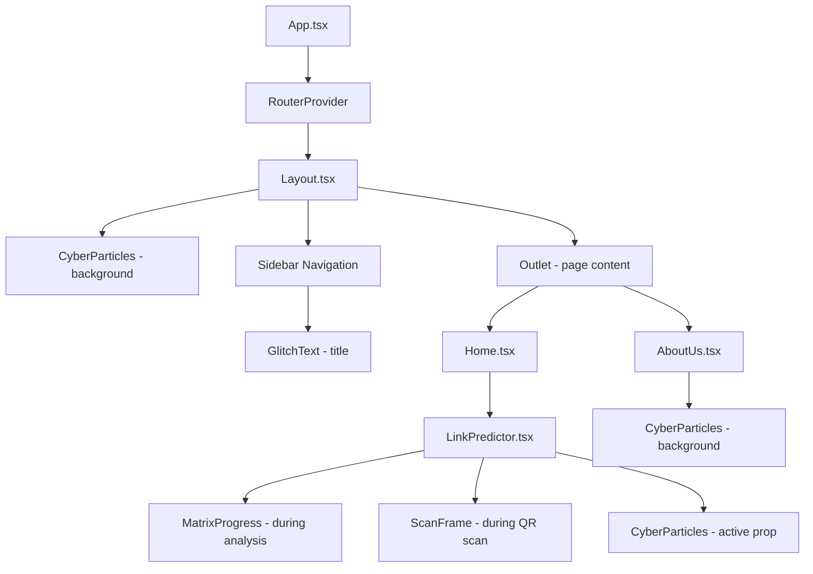
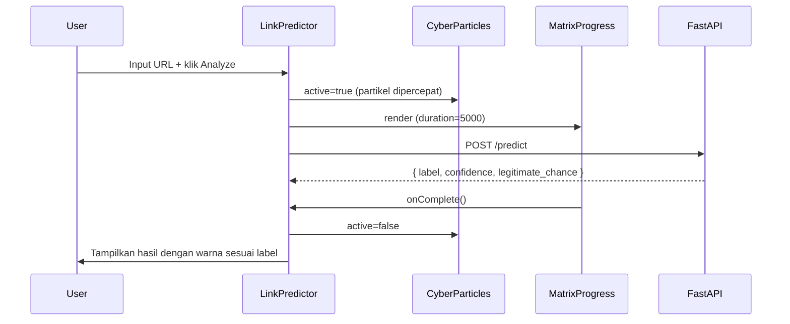

# Design Document: Cyber Dark UI Redesign

## Overview

Redesign ini mengubah tampilan aplikasi **Link Predictor** dari tema light/indigo menjadi tema cyber/dark futuristik. Perubahan mencakup sistem warna neon, efek glassmorphism, partikel interaktif, animasi glitch, progress bar Matrix rain, input cyber-style, dan overlay QR scanner — semuanya tanpa mengubah backend FastAPI atau logika bisnis inti.

Pendekatan desain mengutamakan:
- **Progressive enhancement**: Fungsionalitas tetap bekerja tanpa animasi (untuk `prefers-reduced-motion`)
- **Component isolation**: Setiap komponen visual baru berdiri sendiri dan reusable
- **CSS-first**: Efek visual menggunakan CSS murni sebisa mungkin, library hanya untuk hal yang tidak bisa dilakukan CSS

---

## Architecture



### Alur Data



---

## Components and Interfaces

### 1. CyberParticles

```typescript
interface CyberParticlesProps {
  active?: boolean; // default: false — 2x speed when true
}
```

Menggunakan `@tsparticles/react` v3 API:
- `useCallback` untuk `initParticlesEngine`
- `loadSlim` dari `@tsparticles/slim` sebagai engine
- Konfigurasi partikel: karakter `0`, `1`, `>`, `<`, `#` dengan warna neon-green/cyan
- Interactivity: `repulse` on hover, `push` on click
- Links antar partikel dengan opacity rendah
- Respek `prefers-reduced-motion` via media query check sebelum init

```typescript
// Pola inisialisasi
const [init, setInit] = useState(false);
const initEngine = useCallback(async (engine: Engine) => {
  await loadSlim(engine);
}, []);
```

### 2. GlitchText

```typescript
interface GlitchTextProps {
  children: React.ReactNode;
  className?: string;
}
```

Implementasi menggunakan CSS modules atau `<style>` tag inline dengan `data-text` attribute untuk pseudo-elements. Karena Tailwind v4 tidak mendukung pseudo-element content via utility class, efek glitch menggunakan CSS class yang didefinisikan di `index.css` atau CSS module.

```typescript
// Pola implementasi
<span
  className={`glitch-text ${className}`}
  data-text={typeof children === 'string' ? children : undefined}
>
  {children}
</span>
```

CSS `::before` dan `::after` menggunakan `content: attr(data-text)` dengan `clip-path` dan `transform: translateX` untuk efek split warna merah/cyan.

### 3. MatrixProgress

```typescript
interface MatrixProgressProps {
  duration?: number;    // default: 5000 (ms)
  onComplete: () => void;
}
```

Menggunakan HTML Canvas untuk Matrix rain animation:
- `useRef<HTMLCanvasElement>` untuk canvas element
- `useEffect` untuk animasi loop dengan `requestAnimationFrame`
- `useEffect` terpisah untuk progress counter (interval setiap 50ms)
- Karakter dari set `[0-9, A-Z, >, $, #]`
- Cleanup: `cancelAnimationFrame` dan `clearInterval` saat unmount

```typescript
// Pola progress tracking
useEffect(() => {
  const startTime = Date.now();
  const interval = setInterval(() => {
    const elapsed = Date.now() - startTime;
    const pct = Math.min(100, Math.round((elapsed / duration) * 100));
    setProgress(pct);
    if (pct >= 100) {
      clearInterval(interval);
      onComplete();
    }
  }, 50);
  return () => clearInterval(interval);
}, [duration, onComplete]);
```

### 4. ScanFrame

```typescript
interface ScanFrameProps {
  // Tidak ada props — dimensi mengikuti container
}
```

Pure CSS component:
- `position: absolute; inset: 0` untuk overlay penuh
- `pointer-events: none` agar tidak menghalangi QR detection
- Corner brackets via `::before`/`::after` atau 4 div sudut
- Scan line: `div` dengan `@keyframes scanline` (translateY 0% → 100%)
- Tidak ada library tambahan

### 5. Layout (Redesigned)

Perubahan dari implementasi saat ini:
- Background sidebar: `var(--cyber-bg-alt)` + `border-right: 1px solid var(--glass-border)`
- Judul menggunakan `<GlitchText>`
- Active nav item: `color: var(--neon-green)` + `border-left: 2px solid var(--neon-green)`
- Hover nav item: `color: var(--neon-cyan)` + glow effect
- `<CyberParticles>` di background dengan `z-index: 0`
- `<AnimatePresence>` dari `motion/react` untuk transisi halaman
- Responsive: hamburger menu / bottom nav saat `< 768px`

### 6. LinkPredictor (Redesigned)

Perubahan utama dari implementasi saat ini:

| Area | Sebelum | Sesudah |
|------|---------|---------|
| Card wrapper | `bg-white rounded-2xl shadow-xl` | Glassmorphism (`glass-bg`, `backdrop-blur`) |
| Input URL | `border rounded-lg` | Terminal style dengan prefix `$>`, `border-bottom` neon |
| Tombol Analyze | `bg-indigo-600` | Animated gradient border neon-green/cyan |
| Progress | Simple bar | `<MatrixProgress>` component |
| Hasil | Simple card | Glassmorphism card + warna sesuai label |
| QR overlay | Tidak ada | `<ScanFrame>` overlay |
| Particles | Tidak ada | `<CyberParticles active={isAnalyzing}>` |

### 7. AboutUs (Redesigned)

Konten diganti dengan informasi nyata:
- Deskripsi model deep learning (LSTM/Dense neural network untuk URL feature extraction)
- Stack teknologi: React 18, TypeScript, Vite, Tailwind CSS v4, FastAPI, TensorFlow/Keras
- Statistik model: akurasi ~95%+, jumlah fitur URL yang dianalisis (30+ fitur)
- Layout: grid 2-kolom di desktop, single-column di mobile
- Background: `<CyberParticles>`
- Cards: Glassmorphism dengan Glow_Effect

---

## Data Models

### Theme Tokens (CSS Custom Properties)

Ditambahkan ke `src/styles/theme.css` dalam `:root`:

```css
/* Cyber Dark Theme */
--cyber-bg: #0a0f0f;
--cyber-bg-alt: #0d1117;
--neon-green: #00ff9d;
--neon-cyan: #00ffff;
--neon-red: #ff3b3b;
--text-primary: #e0e0e0;
--glass-bg: rgba(255, 255, 255, 0.05);
--glass-border: rgba(255, 255, 255, 0.1);
--glow-green: 0 0 15px #00ff9d;
--glow-cyan: 0 0 15px #00ffff;
--glow-red: 0 0 15px #ff3b3b;
```

Tailwind v4 `@theme inline` tokens (ditambahkan ke blok `@theme inline` yang sudah ada):

```css
@theme inline {
  --color-cyber-bg: var(--cyber-bg);
  --color-cyber-bg-alt: var(--cyber-bg-alt);
  --color-neon-green: var(--neon-green);
  --color-neon-cyan: var(--neon-cyan);
  --color-neon-red: var(--neon-red);
  --color-text-primary: var(--text-primary);
  --color-glass-bg: var(--glass-bg);
  --color-glass-border: var(--glass-border);
}
```

### Particles Config Shape

```typescript
interface ParticlesConfig {
  particles: {
    number: { value: number };           // 50-80
    color: { value: string[] };          // ['#00ff9d', '#00ffff']
    shape: {
      type: 'char';
      character: { value: string[] };    // ['0','1','>','<','#']
    };
    move: { speed: number };             // normal: 1, active: 2
    links: { enable: boolean; opacity: number };
  };
  interactivity: {
    events: { onHover: { enable: boolean; mode: 'repulse' } };
  };
}
```

### Prediction Result State

```typescript
interface PredictionResult {
  label: 'PHISHING' | 'LEGITIMATE';
  confidence: number;       // 0-100
  legitimate_chance: number; // 0-100
}
```

### Navigation Item

```typescript
interface NavItem {
  path: string;
  label: string;
  icon: LucideIcon;
}
```

---

## Correctness Properties

*A property is a characteristic or behavior that should hold true across all valid executions of a system — essentially, a formal statement about what the system should do. Properties serve as the bridge between human-readable specifications and machine-verifiable correctness guarantees.*

### Property 1: Jumlah partikel dalam batas yang ditentukan

*For any* konfigurasi CyberParticles yang dihasilkan, nilai `particles.number.value` harus berada dalam rentang 50 hingga 80 (inklusif).

**Validates: Requirements 2.2**

---

### Property 2: Kecepatan partikel 2x saat active

*For any* nilai kecepatan normal partikel `v`, ketika prop `active` bernilai `true`, konfigurasi yang dikirim ke tsparticles harus memiliki `particles.move.speed` sama dengan `v * 2`.

**Validates: Requirements 2.8**

---

### Property 3: Karakter Matrix rain dari set yang valid

*For any* karakter yang ditampilkan oleh MatrixProgress pada canvas, karakter tersebut harus merupakan anggota dari set `[0-9, A-Z, >, $, #]`.

**Validates: Requirements 4.5**

---

### Property 4: Progress proporsional terhadap durasi

*For any* nilai `duration` dan waktu yang telah berlalu `t` (di mana `0 ≤ t ≤ duration`), nilai progress yang ditampilkan harus berada dalam rentang `[floor(t/duration * 100) - 1, ceil(t/duration * 100) + 1]` untuk mengakomodasi jitter interval.

**Validates: Requirements 4.3**

---

### Property 5: Warna hasil prediksi sesuai label

*For any* hasil prediksi dengan label `L`, warna yang diterapkan pada elemen status dan Confidence_Bar harus konsisten: jika `L = "PHISHING"` maka warna adalah `Neon_Red` (`#ff3b3b`), jika `L = "LEGITIMATE"` maka warna adalah `Neon_Green` (`#00ff9d`). Tidak ada label lain yang valid.

**Validates: Requirements 9.1, 9.2, 9.3**

---

### Property 6: Active nav item styling konsisten dengan route

*For any* route yang sedang aktif, tepat satu item navigasi harus memiliki style aktif (neon-green color + border-left), dan semua item navigasi lainnya tidak boleh memiliki style aktif tersebut.

**Validates: Requirements 6.3**

---

### Property 7: CyberParticles active saat analisis berlangsung

*For any* state `isAnalyzing`, prop `active` yang dikirim ke CyberParticles harus sama dengan nilai `isAnalyzing` — yaitu `true` saat analisis berlangsung dan `false` saat tidak.

**Validates: Requirements 8.4**

---

### Property 8: Pesan error scanning selalu ditampilkan dengan warna merah

*For any* pesan error QR scanning yang tidak null, elemen yang merender pesan tersebut harus menggunakan warna `Neon_Red` (`#ff3b3b`).

**Validates: Requirements 10.4**

---

### Property 9: CyberParticles menonaktifkan animasi saat prefers-reduced-motion

*For any* environment di mana `prefers-reduced-motion: reduce` aktif, CyberParticles tidak boleh memulai animasi partikel (engine tidak diinisialisasi atau partikel tidak bergerak).

**Validates: Requirements 12.5**

---

## Error Handling

### Network Errors (FastAPI tidak tersedia)

- Saat ini: `alert("Tidak bisa terhubung ke FastAPI")`
- Redesign: Tampilkan error card Glassmorphism dengan warna `Neon_Red`, pesan yang informatif, dan tombol retry
- `isAnalyzing` di-reset ke `false`, `MatrixProgress` di-unmount

### QR Scanning Errors

- Camera permission denied: Pesan error dengan `Neon_Red` dalam card Glassmorphism
- QR tidak terbaca dari gambar: Pesan error yang sama
- Error state di-clear saat user mencoba scan baru

### Particles Engine Init Failure

- Jika `loadSlim` gagal (browser tidak support): Komponen tidak merender canvas, halaman tetap berfungsi normal tanpa partikel
- Gunakan `try/catch` di dalam `initEngine` callback

### Canvas tidak tersedia (MatrixProgress)

- Jika `canvas.getContext('2d')` mengembalikan `null`: Fallback ke simple progress bar dengan CSS
- Guard: `if (!ctx) return;` di dalam animation loop

### Font Loading Failure

- `@fontsource/jetbrains-mono` gagal load: CSS `font-family` stack sudah menyertakan fallback monospace
- Stack: `'JetBrains Mono', 'Fira Code', 'Consolas', monospace`

---

## Testing Strategy

### Dual Testing Approach

Testing menggunakan dua pendekatan komplementer:
- **Unit tests**: Contoh spesifik, edge cases, integrasi komponen
- **Property-based tests**: Properti universal yang berlaku untuk semua input valid

### Unit Testing

Framework: **Vitest** + **@testing-library/react**

Fokus unit tests:
- Rendering komponen dengan berbagai props
- Callback `onComplete` dipanggil setelah durasi selesai (MatrixProgress)
- Ikon paste berubah ke centang setelah paste berhasil (LinkPredictor)
- ScanFrame dirender saat `isScanning=true`
- MatrixProgress dirender saat `isAnalyzing=true`
- Konten AboutUs mengandung informasi model dan stack teknologi
- CSS variables cyber theme terdefinisi di `:root`
- Kontras warna `#e0e0e0` vs `#0a0f0f` memenuhi rasio 4.5:1

Contoh unit test:
```typescript
// Kontras warna (kalkulasi WCAG)
test('text-primary vs cyber-bg contrast ratio >= 4.5', () => {
  const ratio = calculateContrastRatio('#e0e0e0', '#0a0f0f');
  expect(ratio).toBeGreaterThanOrEqual(4.5);
});

// onComplete callback
test('MatrixProgress calls onComplete after duration', async () => {
  const onComplete = vi.fn();
  render(<MatrixProgress duration={100} onComplete={onComplete} />);
  await waitFor(() => expect(onComplete).toHaveBeenCalledOnce(), { timeout: 200 });
});
```

### Property-Based Testing

Framework: **fast-check** (TypeScript-native PBT library)

Konfigurasi: minimum **100 iterasi** per property test.

Setiap property test harus diberi tag komentar:
```
// Feature: cyber-dark-ui-redesign, Property N: <deskripsi property>
```

#### Property Test 1: Jumlah partikel dalam batas

```typescript
// Feature: cyber-dark-ui-redesign, Property 1: Jumlah partikel dalam batas 50-80
it('particle count is always between 50 and 80', () => {
  fc.assert(
    fc.property(fc.boolean(), (active) => {
      const config = buildParticlesConfig(active);
      return config.particles.number.value >= 50 &&
             config.particles.number.value <= 80;
    }),
    { numRuns: 100 }
  );
});
```

#### Property Test 2: Kecepatan 2x saat active

```typescript
// Feature: cyber-dark-ui-redesign, Property 2: Kecepatan partikel 2x saat active=true
it('active=true doubles particle speed', () => {
  fc.assert(
    fc.property(fc.float({ min: 0.1, max: 10 }), (baseSpeed) => {
      const normal = buildParticlesConfig(false, baseSpeed);
      const active = buildParticlesConfig(true, baseSpeed);
      return active.particles.move.speed === normal.particles.move.speed * 2;
    }),
    { numRuns: 100 }
  );
});
```

#### Property Test 3: Karakter Matrix rain valid

```typescript
// Feature: cyber-dark-ui-redesign, Property 3: Karakter Matrix rain dari set valid
it('all matrix rain characters are from valid set', () => {
  const validChars = new Set('0123456789ABCDEFGHIJKLMNOPQRSTUVWXYZ>$#');
  fc.assert(
    fc.property(fc.integer({ min: 1, max: 1000 }), (seed) => {
      const char = getRandomMatrixChar(seed);
      return validChars.has(char);
    }),
    { numRuns: 100 }
  );
});
```

#### Property Test 4: Progress proporsional

```typescript
// Feature: cyber-dark-ui-redesign, Property 4: Progress proporsional terhadap durasi
it('progress value is proportional to elapsed time', () => {
  fc.assert(
    fc.property(
      fc.integer({ min: 1000, max: 10000 }),
      fc.float({ min: 0, max: 1 }),
      (duration, ratio) => {
        const elapsed = Math.floor(duration * ratio);
        const expected = Math.round((elapsed / duration) * 100);
        const actual = calculateProgress(elapsed, duration);
        return Math.abs(actual - expected) <= 2; // toleransi jitter
      }
    ),
    { numRuns: 100 }
  );
});
```

#### Property Test 5: Warna hasil prediksi sesuai label

```typescript
// Feature: cyber-dark-ui-redesign, Property 5: Warna hasil prediksi konsisten dengan label
it('result color matches label', () => {
  fc.assert(
    fc.property(
      fc.record({
        label: fc.constantFrom('PHISHING', 'LEGITIMATE'),
        confidence: fc.integer({ min: 0, max: 100 }),
        legitimate_chance: fc.integer({ min: 0, max: 100 }),
      }),
      (result) => {
        const color = getResultColor(result.label);
        if (result.label === 'PHISHING') return color === '#ff3b3b';
        if (result.label === 'LEGITIMATE') return color === '#00ff9d';
        return false;
      }
    ),
    { numRuns: 100 }
  );
});
```

#### Property Test 6: Active nav item tepat satu

```typescript
// Feature: cyber-dark-ui-redesign, Property 6: Tepat satu nav item aktif sesuai route
it('exactly one nav item is active for any route', () => {
  fc.assert(
    fc.property(fc.constantFrom('/', '/about'), (route) => {
      const items = getNavItems();
      const activeItems = items.filter(item => isNavItemActive(item.path, route));
      return activeItems.length === 1;
    }),
    { numRuns: 100 }
  );
});
```

#### Property Test 7: CyberParticles active = isAnalyzing

```typescript
// Feature: cyber-dark-ui-redesign, Property 7: CyberParticles active prop = isAnalyzing state
it('CyberParticles active prop equals isAnalyzing state', () => {
  fc.assert(
    fc.property(fc.boolean(), (isAnalyzing) => {
      const { getByTestId } = render(
        <LinkPredictorWithState isAnalyzing={isAnalyzing} />
      );
      const particles = getByTestId('cyber-particles');
      return particles.getAttribute('data-active') === String(isAnalyzing);
    }),
    { numRuns: 100 }
  );
});
```

#### Property Test 8: Error message selalu merah

```typescript
// Feature: cyber-dark-ui-redesign, Property 8: Pesan error QR selalu menggunakan Neon_Red
it('scan error message always uses neon-red color', () => {
  fc.assert(
    fc.property(fc.string({ minLength: 1 }), (errorMsg) => {
      const { getByRole } = render(<LinkPredictorWithError error={errorMsg} />);
      const errorEl = getByRole('alert');
      const style = window.getComputedStyle(errorEl);
      return style.color === 'rgb(255, 59, 59)'; // #ff3b3b
    }),
    { numRuns: 100 }
  );
});
```

#### Property Test 9: Reduced-motion menonaktifkan partikel

```typescript
// Feature: cyber-dark-ui-redesign, Property 9: prefers-reduced-motion menonaktifkan animasi partikel
it('CyberParticles disables animation when prefers-reduced-motion is active', () => {
  fc.assert(
    fc.property(fc.boolean(), (active) => {
      // Mock matchMedia untuk prefers-reduced-motion: reduce
      mockMatchMedia({ prefersReducedMotion: true });
      const { container } = render(<CyberParticles active={active} />);
      // Canvas tidak boleh dirender atau partikel tidak bergerak
      const canvas = container.querySelector('canvas');
      return canvas === null || canvas.getAttribute('data-animated') === 'false';
    }),
    { numRuns: 100 }
  );
});
```
